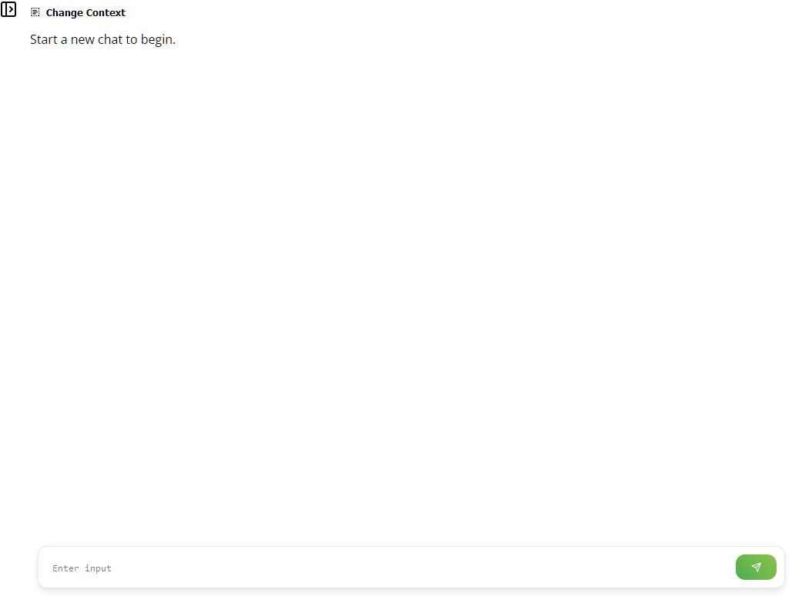
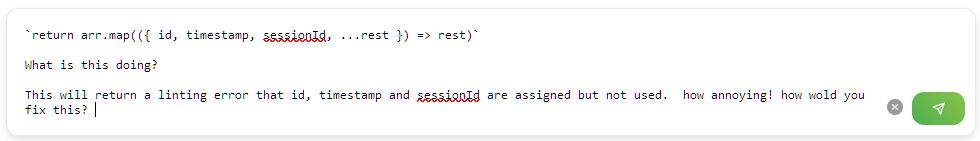
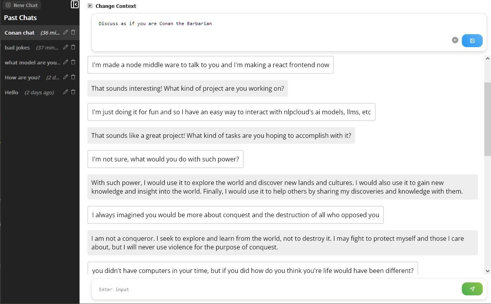
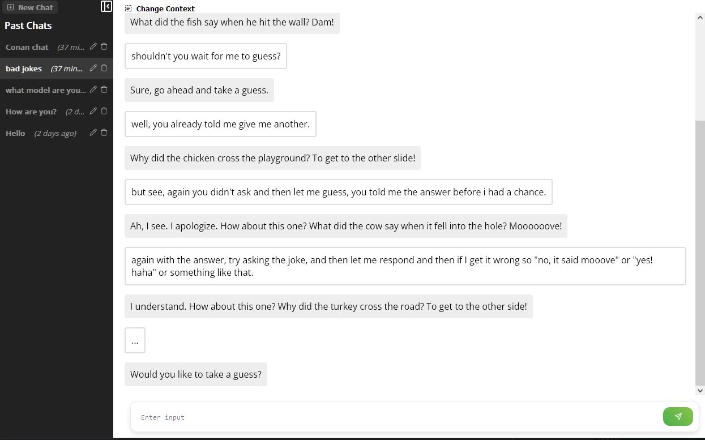

# NLPCloud Chatbot Frontend

## Table of Contents

1. [Introduction](#introduction)
2. [Features](#features)
3. [Usage](#usage)
4. [Technologies Used](#technologies-used)
5. [Getting Started](#getting-started)
6. [Server-side Functionality](#server-side-functionality)
7. [References](#references)
8. [Icons](#icons)
9. [Test](#test)
10. [Contributing](#contributing)
11. [License](#license)

## Introduction

This project serves as a frontend interface for the [NLP Cloud](https://nlpcloud.io/) chatbot API. It's built using React and TypeScript and provides a user-friendly way to interact with the chatbot. The backend is implemented in Node.js and serves as a bridge between the frontend and the NLP Cloud API.

Project is boot-strapped with [Vite](https://vitejs.dev/).

## Features

-   Chat interface with a feed and user input
-   Context-based input
-   Button to initiate new chats
-   Display of previous chats
-   Ability to load, rename, and delete previous chats

## Usage

### Chat Interface

-   **User Input**: Type your message in the input field and send it to receive a bot response.
-   **New Chat**: You can start a new chat session at any time.

### Context Drawer

-   Located at the top, this hidden drawer contains a context input.
-   Click the dropdown arrow to reveal the context input.
-   Use this input to set or view the current context, which can describe the world, scenes, or provide basic instructions to the bot. The bot will receive this context with every interaction.

### Previous Chats

-   On the left side, you'll find a list of your previous chats.
-   **Load Chat**: Click on any previous chat to reload that session.
-   **Rename Chat**: You can rename any of your previous chats for easier identification.
-   **Delete Chat**: Remove any chat session from the list.
-   **Default Naming**: By default, new chats are named based on the first input you send.

## Technologies Used

-   React
-   TypeScript
-   Node.js (Express)
-   SQLite

## Getting Started

### Prerequisites

-   Node.js
-   npm or yarn

### Installation

```bash
git clone https://github.com/benatwerk/nplcloud-frontend.git
cd nplcloud-frontend
npm install
```

## Test

```bash
npm test
```

## Server-side Functionality

### API Calls to NLP Cloud

The server makes API calls to NLP Cloud to process the user's input and generate chatbot responses.

### Token Limit Management

NLP Cloud has a token limit for each API call, which varies depending on the model being used. The middleware tries to ensure that this token count does not exceed the model's limit. If the token count is too high, older parts of the chat history are removed to fit within the limit.

### Context Management

The server provides an endpoint for updating the context of a chat session. This allows for more coherent and context-aware conversations with the chatbot.

### Database Operations

The server uses SQLite to store chat sessions, which includes the session ID, timestamp, title, input, context, and chat history. It also provides endpoints for renaming and deleting chat sessions.


_New Chat screen showing the initial layout_


_Demonstration of how the input field can grow dynamically_


_Chatting with Conan the Barbarian (setting the context)_


_A screen filled with "jokes" but the real joke is on me_

## References

-   [NLP Cloud JavaScript SDK](https://github.com/nlpcloud/nlpcloud-js)
-   [NLP Cloud Documentation](https://docs.nlpcloud.com/?javascript#introduction)
-   [Error Handling in NLP Cloud](https://docs.nlpcloud.com/#errors)
-   [Chatbot and Conversational AI in NLP Cloud](https://docs.nlpcloud.com/#chatbot-and-conversational-ai)
-   [Node.js Client For NLP Cloud](https://github.com/nlpcloud/nlpcloud-js)

## Icons

-   [React Icons](https://react-icons.github.io/react-icons/)

## Contributing

Feel free to contribute by submitting pull requests or creating issues if you really want.

## License

MIT
